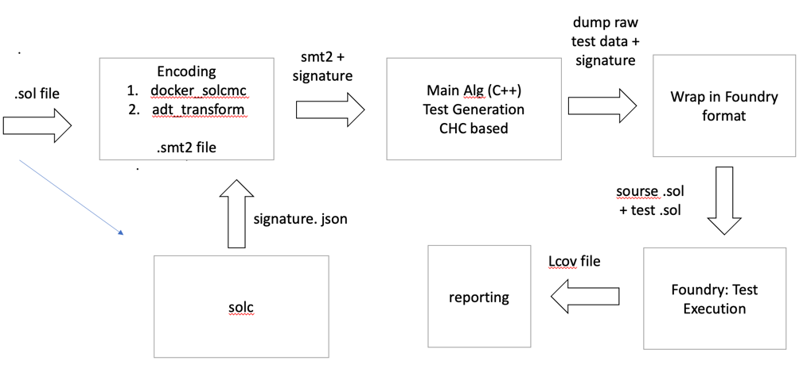
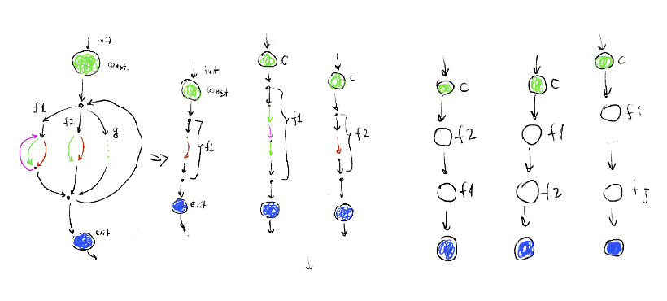
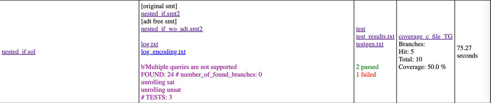

# solidity_testgen

Test generation for Solidity in Foundry format  (https://github.com/foundry-rs/foundry)

Example of Contract under Test:
```
contract C {

    uint x;

	function f(uint _x) public {}
	function g(uint _x, uint _y) public {}
	function w(uint _x) public {}


	function i(uint _x) internal {}
}
```
Expected results of Test Generation:
```
import "forge-std/Test.sol";
import "../src/contract_under_test.sol";

contract contract_under_test_Test is Test {
	C c0, c1, c2, ... cN;

	function setUp() public {
		c0 = new C(); c1 = new C(); ... cN = new C();
	}
	function test_0() public {
		c0.f();
		c0.g();
		....
		c0.w();
	}
........
    function test_n() public {
		cN.g();
		cN.w();
		....
		cN.w();
	}
}
```


### Dependincies / Setup

* [Docker](https://docs.docker.com/engine/install/)

* [Solidity Compiler](https://docs.soliditylang.org/en/latest/installing-solidity.html)

* [Foundry](https://book.getfoundry.sh/getting-started/installation)

* Python3 & pip

* GenHtml (part or lcov)

After dependencies are installed, you also need to install all of the package requirements, by calling
```
pip install -r requirements.txt
```

### Architecture


### Building Tests as CHCs-paths-tree


#### build project
`forge build`

#### run all tests
`forge test`

#### run specified test
`forge test --match Loop*`

#### run test generation for specified sol-file with Python 
`python3 ./scripts/SolidityTestGen.py -i ./src/Loop_1.sol`

#### run test generation for folder with sol-files with Python
`python3 ./scripts/RunAll.py -i folder_path -o ../testgen_output`

#### Report example:


#### Generate a report:
`python3 ./scripts/ReportBuilder.py -i testgen_dir`