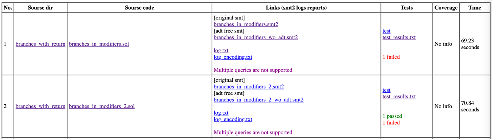

# solidity_testgen

Test generation for Solidity 

### Dependincies / Setup
* Aeval TestGen (https://github.com/izlatkin/aeval) 
```
git clone https://github.com/izlatkin/aeval
cd aeval
git checkout tg-nonlin
mkdir build ; cd build
cmake ../
cmake --build .  && cmake /home/fmfsu/Dev/blockchain/aeval
make
```
* SMT Encoder set up 
```
git clone https://github.com/leonardoalt/cav_2022_artifact
cd cav_2022_artifact
create a copy of https://raw.githubusercontent.com/ethereum/solc-js/master/smtsolver.ts
remove "solverOutput = execSync ..." section
add line to Dockerfile-solcmc: 
COPY smtsolver_u.ts /home/solc-js/smtsolver.ts
echo "RUN sed -i 's/let solverOutput;/console.log(query); let solverOutput;/g' /home/solc-js/smtsolver.ts" >> Dockerfile-solcmc
docker build -f Dockerfile-solcmc . --rm -t testgen/cav
```

* Solidity Compiler ( > 8.x)
```
npm install -g solc
sudo snap install solc
```

* Foundry (source https://github.com/foundry-rs/foundry)
```
git clone https://github.com/foundry-rs/foundry
cd foundry
cargo install --path ./cli --bins --locked --force
cargo install --path ./anvil --locked --force
```

* LCov
```brew install lcov```
* GenHtml (part or lcov)

used for 
`solc a.sol --ast-compact-json`
example of command
`./docker_solcmc examples smoke_safe.sol Smoke 30 z3`
* ADT 
```
git clone https://github.com/leonardoalt/adt_transform
cd adt_transform 
cargo build
```
location of executable file and example of command
`./target/debug/adt_transform adt_free.smt2`

#### build project
`forge build`

#### run all tests
`forge test`

#### run specified test
`forge test --match Loop*`

#### run test generation for specified sol-file with Python 
`python3 ./scripts/SolidityTestGen.py -i ./src/Loop_1.sol`

#### run test generation for folder with sol-files with Python
`python3 ./scripts/RunAll.py -i folder_path -o ../testgen_output`

#### Report example:


#### Generate a report:
`python3 ./scripts/ReportBuilder.py -i testgen_dir`